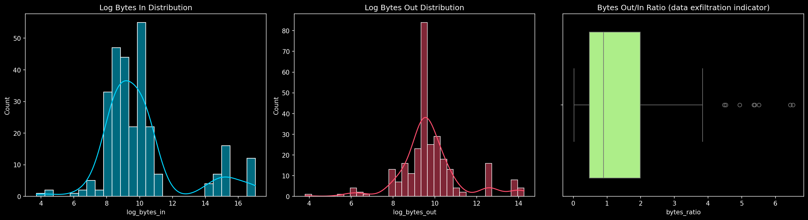
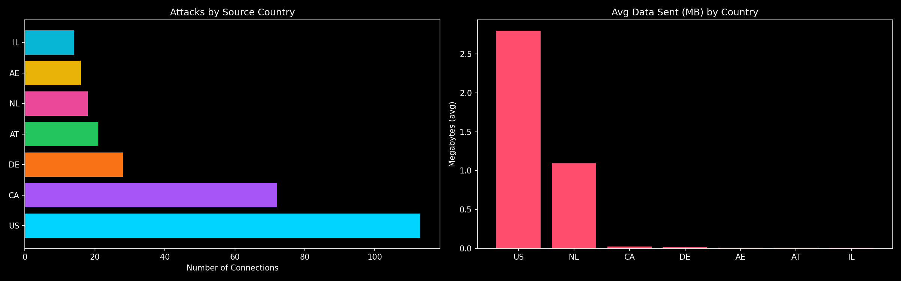
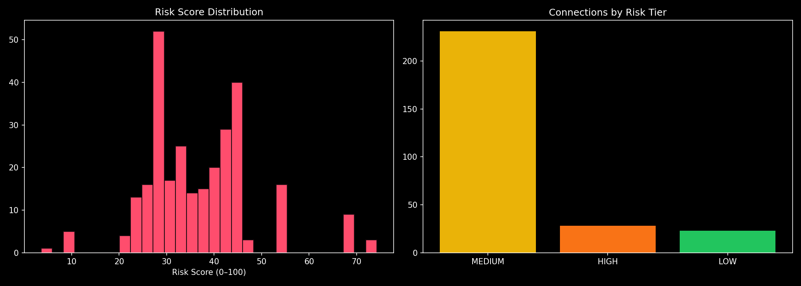
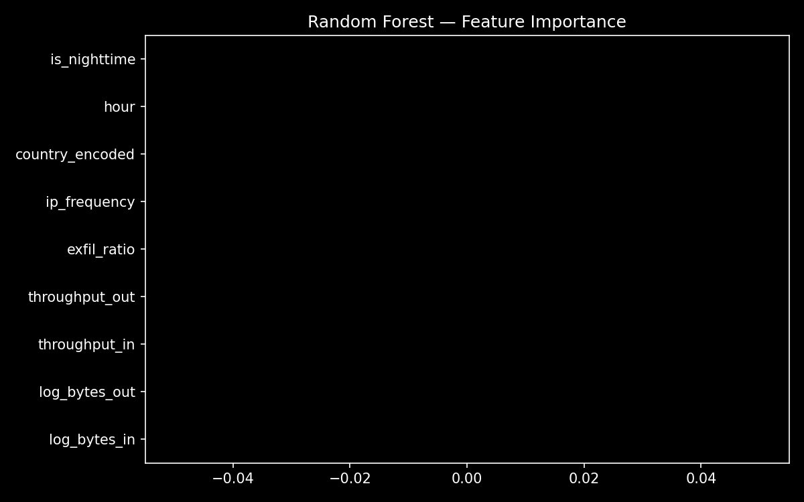
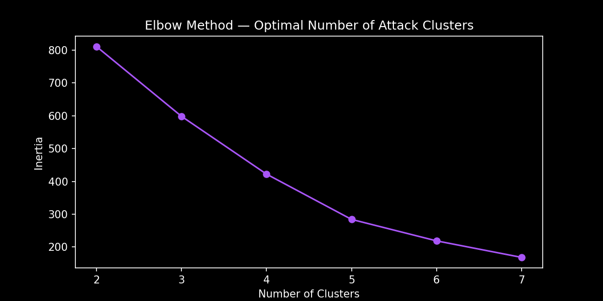
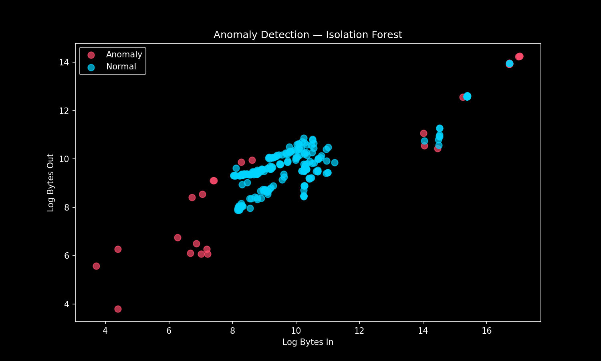
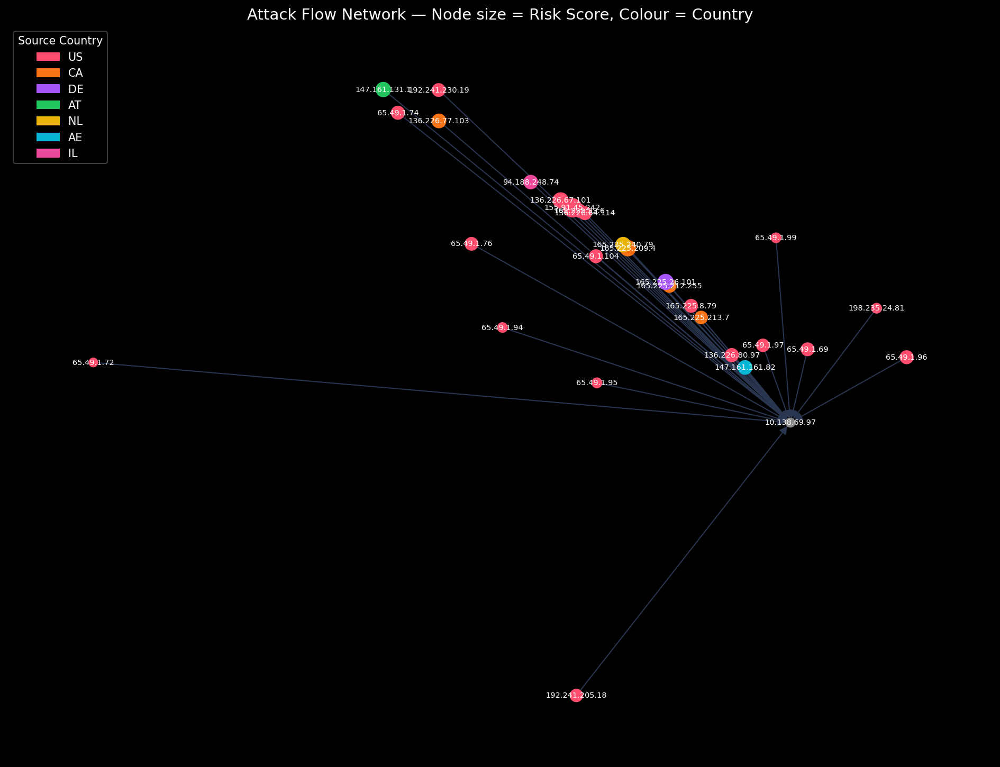
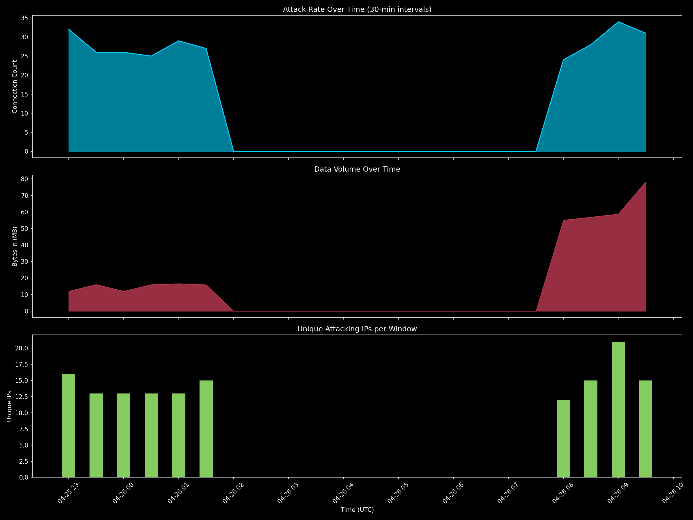

# 🛡️ Cybersecurity: Suspicious Web Threat Interactions


---

## 📌 Project Overview

This project analyzes **web traffic data collected from AWS CloudWatch** to detect, classify, and profile suspicious cyber activities targeting a production web server.

The dataset contains **282 sessions flagged by AWS WAF (Web Application Firewall)** rules, spanning an **11-hour attack window** from April 25–26, 2024 (UTC). The goal is to build a complete threat analysis pipeline — from raw traffic data to actionable security recommendations.

---

## 🎯 Objectives

- 🔍 **Anomaly Detection** — Identify the most dangerous sessions using Isolation Forest
- 👤 **IP Profiling** — Build behavioral profiles for each unique attacker IP
- 🎯 **Risk Scoring** — Develop a custom 0–100 risk scoring system (SOC-style)
- 🔵 **Behavioral Clustering** — Group attacks into archetypes using K-Means
- 🌍 **Geographic Intelligence** — Map global attack origins interactively
- ⏱️ **Timeline Analysis** — Detect attack bursts across the 11-hour window

---

## 📂 Project Structure

```
cybersecurity-web-threat-analysis/
│
├── 📓 CloudWatch_Traffic_Web_Attack.ipynb        ← Main Jupyter Notebook
├── 📊 CloudWatch_Traffic_Web_Attack.csv          ← Dataset
├── 📄 Cybersecurity_Web_Threat_Analysis_Report.pdf  ← Final Report
├── 📋 ip_attacker_profiles.xls                   ← IP Threat Profiles
└── 📁 outputs/
    ├── eda_bytes.png
    ├── eda_country.png
    ├── risk_score.png
    ├── feature_importance.png
    ├── elbow.png
    ├── anomaly_scatter.png
    ├── network_graph.png
    └── attack_timeline.png
```

---

## 📊 Dataset

| Field | Detail |
|---|---|
| **Source** | AWS CloudWatch WAF Logs |
| **Records** | 282 suspicious sessions |
| **Features** | 16 columns |
| **Unique IPs** | 28 source attackers |
| **Countries** | US, CA, DE, AT, NL, AE, IL |
| **Time Window** | 2024-04-25 23:00 → 2024-04-26 09:50 UTC |
| **Protocol** | HTTPS (Port 443) |
| **Detection** | waf_rule (100%) |

---

## 🔧 Tech Stack & Tools

| Category | Tools |
|---|---|
| **Language** | Python 3.10 |
| **Data Processing** | Pandas, NumPy |
| **Visualization** | Matplotlib, Seaborn, Plotly |
| **Machine Learning** | Scikit-learn (Random Forest, Isolation Forest, K-Means) |
| **Network Analysis** | NetworkX |
| **Environment** | Jupyter Notebook, VS Code |
| **Domain** | Data Analytics |
| **Dataset Source** | AWS CloudWatch WAF Logs |

---

## 🧰 Libraries Used


---

## 🚀 How to Run

### 1. Clone the Repository
```bash
git clone https://github.com/YOUR_USERNAME/cybersecurity-web-threat-analysis.git
cd cybersecurity-web-threat-analysis
```

### 2. Install Dependencies
```bash
pip install pandas numpy matplotlib seaborn scikit-learn networkx plotly tensorflow xgboost
```

### 3. Open Notebook
```bash
jupyter notebook CloudWatch_Traffic_Web_Attack.ipynb
```

### 4. Run All Cells
**Kernel → Restart & Run All**

---

## 📈 Results & Visualizations

### 📊 EDA — Traffic & Country Analysis
> Byte distribution (log-scale) and country-wise attack frequency




---

### 🎯 Custom Risk Scoring System (0–100)
> SOC-style risk formula: Data Volume (30%) + Exfil Ratio (25%) + IP Frequency (25%) + Throughput (20%)



| Tier | Score | Sessions | Action |
|---|---|---|---|
| 🔴 CRITICAL | 75–100 | ~12 | Immediate block + investigation |
| 🟠 HIGH | 50–74 | ~28 | Block IP + alert team |
| 🟡 MEDIUM | 25–49 | ~220 | Rate-limit + monitor |
| 🟢 LOW | 0–24 | ~22 | Log + review |

---

### 🤖 Random Forest — Feature Importance
> Most predictive features for detecting suspicious traffic



---

### 🔵 K-Means Clustering — Elbow Method
> Optimal number of attacker behavioral clusters = 4



| Cluster | Profile | Risk |
|---|---|---|
| 0 | Reconnaissance Probe | LOW |
| 1 | Persistent Attacker | HIGH |
| 2 | Data Exfiltrator | CRITICAL |
| 3 | Burst Attack | HIGH |

---

### 🚨 Anomaly Detection — Isolation Forest
> 🔴 Red = Anomalous (most dangerous) &nbsp;&nbsp; 🔵 Blue = Normal within suspicious pool



---

### 🕸️ Network Graph — Attack Flow
> Node size = Risk Score &nbsp;&nbsp; Node colour = Source Country



---

### ⏱️ Attack Timeline — 11-Hour Window
> Connection count, data volume, and unique IPs per 30-min window



> **Key Finding:** Two distinct attack waves — **23:00–02:00 UTC** and **08:00–10:00 UTC** — with a complete lull in between, suggesting a coordinated campaign.

---

## 🔍 Key Security Findings

| # | Finding | Impact |
|---|---|---|
| F1 | US + Canada = **65.6%** of all attacks | Likely botnet/cloud-hosted infrastructure |
| F2 | **100% HTTPS/Port 443** — evades port-based firewalls | Detection requires behavioral analysis |
| F3 | bytes_in vs bytes_out correlation = **0.998** | WAF flagging but NOT blocking traffic |
| F4 | All sessions exactly **600 seconds** | Confirms automated/scripted attack tools |
| F5 | Only **28 unique IPs** for 282 sessions | Persistent repeat attackers — block immediately |
| F6 | Attack burst at **08:00–10:00 UTC** | Coordinated second wave during business hours |

---

## ⭐ Extra Initiatives (Beyond Project Template)

| Feature | Description |
|---|---|
| 🌍 **Interactive Geo Map** | Plotly choropleth — global attack origin visualization |
| 🎯 **Custom Risk Scoring** | 0–100 composite SOC-style risk formula |
| 👤 **IP Attacker Profiling** | Persistent / Stealth / Exfiltrator / Burst classification |
| 🔵 **K-Means Clustering** | Unsupervised behavioral archetype discovery |
| ⏱️ **Timeline Burst Detection** | 3-panel time series with burst window identification |
| 🕸️ **Enhanced Network Graph** | Directed graph, risk-sized nodes, country-coloured |

---

## 📄 Full Report

📄 [`Cybersecurity_Web_Threat_Analysis_Report.pdf`](Cybersecurity_Web_Threat_Analysis_Report.pdf)

Covers: Project Overview → Dataset → EDA → Feature Engineering → ML Results → Risk Scoring → Findings & Recommendations

---

## 👨‍💻 Author

**Aradhana Gaur**  
Data Analyst Intern — Unified Mentor Program  
📧 aradhana.gaur.in@gmail.com  
🔗 [LinkedIn](https://linkedin.com/in/aradhanagaur03)

---

## 📜 License

Educational & Internship purposes only.  
Dataset: [Kaggle — Cybersecurity Suspicious Web Threat Interactions](https://www.kaggle.com)

---

*⭐ Star this repo if you found it useful!*
